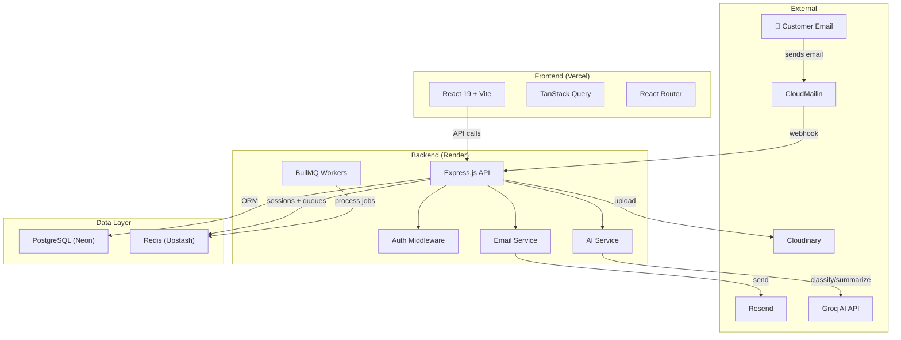

# ResolveNow — AI-Powered Ticket Management System

An internal support platform that ingests emails, auto-classifies tickets via AI, generates personalized responses, and gives agents a modern dashboard to manage everything.

> **Note — Actual Implementation Deviations:**  
> The following decisions were made during implementation and differ from the original plan:
> - **Authentication**: Uses **Better Auth** instead of `express-session` + `bcrypt`. Better Auth provides session management, credential hashing, and RBAC out of the box.
> - **Background Jobs / Queue**: Uses **pg-boss** (PostgreSQL-backed job queue) instead of **Redis + Bull/BullMQ**. No Redis service is required — the same Postgres DB is used for the job queue.
> - **AI SDK**: Uses **Vercel AI SDK** (`ai` package) to abstract model calls, rather than calling the Groq API SDK directly.
> - **Docker Compose**: `docker-compose.yml` provisions only PostgreSQL (no Redis needed).
> - **File Storage**: Cloudinary is used for attachment uploads from inbound emails (CloudMailin webhook).

---

## Proposed Changes

### Phase 1 · Project Foundation & Dev Environment

> Get both apps scaffolded, linted, formatted, Dockerized, and talking to a real database — before writing any business logic.

#### Backend (`/backend`)

| # | Task | Details |
|---|------|---------|
| 1.1 | Initialize Node + Express + TypeScript | `npm init`, tsconfig, `src/index.ts` with a health-check route |
| 1.2 | Add ESLint + Prettier | Shared config, `.eslintrc`, `.prettierrc`, lint scripts |
| 1.3 | Add Helmet, CORS, rate-limit, Pino logger | Global middleware stack wired in `app.ts` |
| 1.4 | Setup Prisma ORM | `npx prisma init`, configure `DATABASE_URL` for PostgreSQL |
| 1.5 | Docker & docker-compose | `Dockerfile` for backend, `docker-compose.yml` with **PostgreSQL** service (pg-boss replaces Redis) |
| 1.6 | Environment config | `.env.example`, `src/config/env.ts` with Zod-validated env vars |
| 1.7 | Error handling middleware | Global error handler, custom `AppError` class, async route wrapper |

#### Frontend (`/frontend`)

| # | Task | Details |
|---|------|---------|
| 1.8 | Scaffold Vite + React 19 + TypeScript | `npm create vite@latest` |
| 1.9 | Install Tailwind CSS + shadcn/ui | `tailwind.config.ts`, `globals.css`, init shadcn |
| 1.10 | Setup React Router | Route structure with layout wrappers (`AuthLayout`, `DashboardLayout`) |
| 1.11 | Setup TanStack Query | `QueryClientProvider`, default stale/retry config |
| 1.12 | API client utility | Axios/fetch wrapper with base URL, credentials, error interceptor |
| 1.13 | ESLint + Prettier for frontend | Shared config consistent with backend |

#### Repo-Level

| # | Task | Details |
|---|------|---------|
| 1.14 | GitHub repo + branching strategy | `main` / `dev` branches, PR template |
| 1.15 | GitHub Actions CI | Lint → Type-check → Build on every PR |

**Exit Criteria:** `docker-compose up` starts backend (health-check responds), frontend dev server loads a blank shell, Prisma connects to Postgres.

---

### Phase 2 · Database Schema & Authentication

> Define the core data model and lock down the app with session-based auth + RBAC.

#### Database Schema (Prisma)

| # | Task | Details |
|---|------|---------|
| 2.1 | Design & create Prisma schema | Models: `User`, `Ticket`, `TicketReply`, `KnowledgeBaseArticle`, `AuditLog` |
| 2.2 | User model | `id`, `email`, `name`, `passwordHash`, `role` (ADMIN / AGENT), `createdAt`, `updatedAt` |
| 2.3 | Ticket model | `id`, `subject`, `body`, `senderEmail`, `senderName`, `status` (OPEN / RESOLVED / CLOSED), `category` (GENERAL / TECHNICAL / REFUND), `priority`, `assignedToId`, `aiSummary`, `aiCategory`, `createdAt`, `updatedAt` |
| 2.4 | TicketReply model | `id`, `ticketId`, `body`, `senderType` (AGENT / AI / CUSTOMER), `createdByUserId`, `createdAt` |
| 2.5 | KnowledgeBaseArticle model | `id`, `title`, `content`, `category`, `createdAt`, `updatedAt` |
| 2.6 | Run initial migration | `npx prisma migrate dev --name init` |
| 2.7 | Seed script | Seed an admin user + sample knowledge base articles |

#### Authentication (Backend)

| # | Task | Details |
|---|------|---------|
| 2.8 | Setup Better Auth | Replaces express-session + Redis. Provides session management, RBAC, and credential handling via `better-auth` package |
| 2.9 | Auth routes | Better Auth mounts at `POST/GET /api/auth/**` via Express wildcard + `toNodeHandler(auth)` |
| 2.10 | Password hashing | Handled internally by Better Auth |
| 2.11 | Auth middleware | `requireAuth` — reject if no session; `requireAdmin` — reject if not ADMIN role |
| 2.12 | Input validation | Zod schemas for all payloads, reusable `validate()` middleware |

#### Authentication (Frontend)

| # | Task | Details |
|---|------|---------|
| 2.13 | Login page UI | Email + password form using React Hook Form + Zod resolver, shadcn components |
| 2.14 | Auth context / hook | `useAuth()` — stores user, exposes `login()`, `logout()`, `isAdmin` |
| 2.15 | Protected routes | `<ProtectedRoute>` wrapper that redirects to `/login` if unauthenticated |
| 2.16 | Session persistence | On app load, call `GET /api/auth/me` to restore session |

**Exit Criteria:** Admin can log in, session persists across refreshes, unauthenticated users are redirected to login.

---

### Phase 3 · Core Ticket Management (CRUD)

> The bread-and-butter of the system — create, list, view, update, and reply to tickets manually.

#### Backend

| # | Task | Details |
|---|------|---------|
| 3.1 | Ticket CRUD routes | `GET /api/tickets` (list + filter + sort + paginate), `GET /api/tickets/:id`, `PATCH /api/tickets/:id` (status, category, assignee) |
| 3.2 | Ticket filtering & sorting | Query params: `status`, `category`, `assignedTo`, `search`, `sortBy`, `order` |
| 3.3 | Pagination | Cursor-based or offset pagination with `page` & `limit` |
| 3.4 | Ticket reply routes | `POST /api/tickets/:id/replies`, `GET /api/tickets/:id/replies` |
| 3.5 | Assign / reassign ticket | `PATCH /api/tickets/:id` with `assignedToId` |
| 3.6 | Validation schemas | Zod schemas for every ticket endpoint |

#### Frontend

| # | Task | Details |
|---|------|---------|
| 3.7 | Ticket list page | Table/card layout with filters (status, category), search bar, sort controls, pagination |
| 3.8 | Ticket detail page | Subject, body, metadata sidebar (status, category, assignee, dates), reply thread |
| 3.9 | Reply composer | Rich text area to type and submit replies |
| 3.10 | Status / category update | Inline dropdowns or action buttons to change ticket status & category |
| 3.11 | Assign agent | Dropdown to assign/reassign ticket to an agent |
| 3.12 | TanStack Query hooks | `useTickets()`, `useTicket(id)`, `useCreateReply()`, `useUpdateTicket()` with optimistic updates |
| 3.13 | Empty & loading states | Skeleton loaders, empty-state illustrations |

**Exit Criteria:** Agents can browse a filterable ticket list, open a ticket, see its full conversation thread, reply, and change status/category/assignee.

---

### Phase 4 · Email Ingestion & Outgoing Emails

> Wire up the email pipeline — inbound emails create tickets, outbound emails notify customers.

#### Inbound (CloudMailin → Tickets)

| # | Task | Details |
|---|------|---------|
| 4.1 | CloudMailin webhook route | `POST /api/webhooks/cloudmailin` — parse incoming email payload |
| 4.2 | Email parser service | Extract `from`, `subject`, `body` (strip HTML), attachments metadata |
| 4.3 | Ticket creation from email | Create a new `Ticket` record from parsed email data |
| 4.4 | Duplicate detection | Match by `senderEmail` + `subject` to thread into existing tickets as replies |
| 4.5 | Webhook signature verification | Validate CloudMailin webhook authenticity |

#### Outbound (Resend)

| # | Task | Details |
|---|------|---------|
| 4.6 | Resend email service | `src/services/email.service.ts` — send transactional emails via Resend API |
| 4.7 | Email templates | HTML templates for: ticket confirmation, agent reply notification |
| 4.8 | Send email on agent reply | When an agent posts a reply, queue an email to the customer |
| 4.9 | Dev email setup | Ethereal Email fallback for local development (no real emails sent) |

#### Background Jobs (BullMQ)

| # | Task | Details |
|---|------|---------|
| 4.10 | BullMQ setup | Queue connection to Redis, worker process |
| 4.11 | Email send queue | `email-send` queue — process outbound emails asynchronously |
| 4.12 | Retry & dead-letter logic | Retry failed emails 3×, move to dead-letter queue |

**Exit Criteria:** Sending an email to the configured address creates a ticket in the system. Agent replies trigger outbound emails to the customer. Jobs are processed via BullMQ.

---

### Phase 5 · AI Features

> The differentiator — plug in Groq-powered AI for classification, summarization, and suggested replies.

#### AI Service (Backend)

| # | Task | Details |
|---|------|---------|
| 5.1 | Groq API client | `src/services/ai.service.ts` — wrapper around Groq SDK with model selection (Llama 3.3 / Kimi K2 / Qwen) |
| 5.2 | Prompt templates | Structured prompts for each AI task with system/user message patterns |
| 5.3 | AI ticket classification | On new ticket creation → call Groq → set `aiCategory` (General / Technical / Refund) and `priority` |
| 5.4 | AI ticket summarization | Generate a concise `aiSummary` for long ticket bodies |
| 5.5 | AI suggested reply | Given ticket + knowledge base context → generate a draft reply for the agent |
| 5.6 | Knowledge base context retrieval | Fetch relevant `KnowledgeBaseArticle` entries by category to inject into prompts |
| 5.7 | AI processing queue | BullMQ `ai-process` queue — run classification + summary asynchronously after ticket creation |
| 5.8 | Error handling & fallbacks | Graceful degradation if Groq API is down — ticket is created without AI fields |

#### AI Features (Frontend)

| # | Task | Details |
|---|------|---------|
| 5.9 | AI classification badge | Show AI-predicted category with a confidence indicator on ticket detail |
| 5.10 | AI summary card | Collapsible card showing AI-generated summary on ticket detail page |
| 5.11 | "Suggest Reply" button | Button in reply composer → fetches AI-suggested reply → populates text area for agent to edit & send |
| 5.12 | AI status indicators | Loading spinners / "AI processing…" states while classification runs |

**Exit Criteria:** New tickets are auto-classified and summarized by AI. Agents can click "Suggest Reply" and get an editable AI-drafted response grounded in the knowledge base.

---

### Phase 6 · User Management & Admin Dashboard

> Give admins the tools to manage agents and see the big picture.

#### User Management (Backend)

| # | Task | Details |
|---|------|---------|
| 6.1 | User CRUD routes (admin-only) | `GET /api/users`, `POST /api/users`, `PATCH /api/users/:id`, `DELETE /api/users/:id` |
| 6.2 | Agent creation | Admin creates agent accounts with temporary password |
| 6.3 | Password reset | Agent can change own password via `PATCH /api/auth/password` |

#### User Management (Frontend)

| # | Task | Details |
|---|------|---------|
| 6.4 | User management page | Table of all agents with name, email, role, created date |
| 6.5 | Create agent modal/form | Form to add new agent (name, email, temp password) |
| 6.6 | Edit / delete agent | Inline actions to edit agent details or deactivate |

#### Dashboard

| # | Task | Details |
|---|------|---------|
| 6.7 | Dashboard API endpoints | `GET /api/dashboard/stats` — ticket counts by status, category, agent; response time metrics |
| 6.8 | Dashboard page | KPI cards (open tickets, avg response time, resolved today) |
| 6.9 | Charts (Recharts) | Bar chart: tickets by category; Line chart: tickets over time; Pie chart: status distribution |
| 6.10 | Agent performance table | Tickets handled, avg resolution time per agent |

**Exit Criteria:** Admins can create/manage agent accounts. Dashboard displays live ticket statistics with interactive charts.

---

### Phase 7 · Polish, Security & Deployment

> Harden the app, optimize performance, and ship it.

#### File Storage

| # | Task | Details |
|---|------|---------|
| 7.1 | Cloudinary integration | Upload service for email attachments |
| 7.2 | Attachment support in tickets | Store attachment URLs on `TicketReply`, display in UI |

#### Security & Hardening

| # | Task | Details |
|---|------|---------|
| 7.3 | Rate limiting tuning | Tighter limits on auth routes, looser on read routes |
| 7.4 | Input sanitization | Sanitize HTML in email bodies to prevent XSS |
| 7.5 | CSRF protection | Double-submit cookie or SameSite cookie config |
| 7.6 | Audit logging | Log admin actions (user creation, ticket reassignment) to `AuditLog` table |

#### Performance

| # | Task | Details |
|---|------|---------|
| 7.7 | Database indexing | Add indexes on `Ticket.status`, `Ticket.category`, `Ticket.assignedToId`, `Ticket.createdAt` |
| 7.8 | Query optimization | Eager-load relations, avoid N+1 queries in ticket list |
| 7.9 | Frontend bundle optimization | Code splitting, lazy routes, image optimization |

#### Deployment

| # | Task | Details |
|---|------|---------|
| 7.10 | Production Dockerfiles | Multi-stage builds for backend |
| 7.11 | Frontend deploy to Vercel | Configure build command, env vars, custom domain |
| 7.12 | Backend deploy to Render | Docker deploy, env vars, health check path |
| 7.13 | Neon PostgreSQL setup | Production database, connection pooling |
| 7.14 | Upstash Redis setup | Production Redis for sessions + BullMQ |
| 7.15 | Cloudinary production bucket | Configure production credentials |
| 7.16 | GitHub Actions CD | Auto-deploy `main` branch on merge |
| 7.17 | Smoke tests | End-to-end test: email → ticket → AI classification → agent reply → outbound email |

**Exit Criteria:** App is live in production. CI/CD pipeline deploys on merge to main. All security hardening is in place.

---

## Architecture Overview

---

## Phase Summary

| Phase | Focus | Est. Tasks |
|-------|-------|-----------|
| **1** | Project Foundation & Dev Environment | 15 tasks |
| **2** | Database Schema & Authentication | 17 tasks |
| **3** | Core Ticket Management (CRUD) | 13 tasks |
| **4** | Email Ingestion & Outgoing Emails | 12 tasks |
| **5** | AI Features | 12 tasks |
| **6** | User Management & Admin Dashboard | 10 tasks |
| **7** | Polish, Security & Deployment | 17 tasks |
| | **Total** | **96 tasks** |

---

## Open Questions

> [!IMPORTANT]
> Please clarify these before we begin implementation:

1. **Knowledge Base management** — Should admins be able to CRUD knowledge base articles through the UI, or will they be seeded / managed directly in the database?
2. **Real-time updates** — Do you want WebSocket/SSE for live ticket updates on the dashboard, or is polling (via TanStack Query refetch intervals) sufficient?
3. **Attachment handling** — Should we support file attachments in agent replies (upload via UI), or only preserve attachments from inbound emails?
4. **Multi-tenancy** — Is this a single-organization system, or should it support multiple tenants/companies?
5. **Notification system** — Beyond email, do agents need in-app notifications (e.g., "New ticket assigned to you")?

---

## Verification Plan

### Automated Tests
- Backend: Unit tests for services (AI, email, auth) + integration tests for API routes
- Frontend: Component tests with Vitest + React Testing Library
- CI: `npm run lint && npm run typecheck && npm run test` on every PR

### Manual Verification
- End-to-end flow: Send email → verify ticket created → check AI classification → agent replies → customer receives email
- Auth flow: Login, session persistence, role-based access
- Dashboard: Verify chart data matches database state
